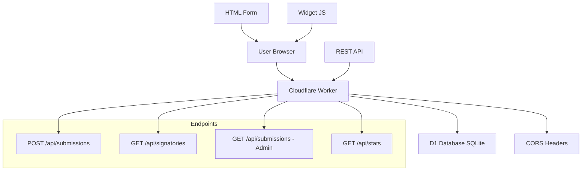

# 📝 Form CF - Simple and Affordable Form System

**🚀 Application available at:** https://form-cf.tarekgorany.workers.dev

A simple form system built on **Cloudflare Workers** and **D1 Database** for creating simple, easy, and very low-cost online forms.

## ✨ Features

- 🚀 **Fast and reliable** - Runs on Cloudflare's global network
- 💰 **Very affordable** - Nearly free cost with Cloudflare Workers
- 🔧 **Easy to install** - Setup in minutes
- 🌍 **English support** - Complete English interface
- 🔒 **Privacy protection** - Email addresses never shown in public lists
- 🛡️ **Advanced encryption** - AES-GCM encryption for all sensitive data
- 📱 **Responsive** - Works on all devices
- 🎨 **Customizable** - Easy to modify and develop
- 🔗 **Easy to embed** - Add to any website with simple code
- 🔐 **Enterprise-grade security** - Data encryption at rest

## 🏗️ Technical Architecture



## 🛡️ Security and Encryption

### 🔐 **Application-Layer Encryption**

The system uses **AES-GCM 256-bit** to encrypt all sensitive data before storing in D1:

#### 🔄 **Encryption Process:**
1. **Encrypted data**: Name, organization, email, comment
2. **Encryption key**: Stored as Worker secret in Cloudflare
3. **Unique IV**: 12 random bytes for each record
4. **Key identifier**: For key rotation support

#### 📊 **Email Protection:**
- **SHA-256 hash**: Prevents duplicates without disclosure
- **No public display**: Email never appears in any public API
- **Limited access**: Only admin with token

#### 🔒 **Security Levels:**
- **At rest**: Encryption in D1 Database
- **In transit**: HTTPS/TLS via Cloudflare
- **In processing**: Decryption only inside Worker
- **Access**: Advanced permission control

```bash
# Setup encryption keys
echo "your-256-bit-key-base64" | npx wrangler secret put ENC_KEY_B64
echo "v1" | npx wrangler secret put ENC_KEY_ID
```

## 📋 Requirements

- [Cloudflare](https://cloudflare.com) account (free)
- [Node.js](https://nodejs.org) (version 18 or newer)
- [Git](https://git-scm.com)

## 🚀 Quick Installation

### 1. Clone the project

```bash
git clone https://github.com/YOUR-USERNAME/form-cf.git
cd form-cf
npm install
```

### 2. Setup Cloudflare D1

```bash
# Create D1 database
npx wrangler d1 create form_db

# Copy database_id from result and put it in wrangler.toml
# Apply initial migration
npx wrangler d1 migrations apply form_db

# Verify tables
npx wrangler d1 execute form_db --command="SELECT name FROM sqlite_master WHERE type='table';"
```

### 3. Setup encryption keys

```bash
# Generate 256-bit encryption key (32 bytes)
node -e "console.log(require('crypto').randomBytes(32).toString('base64'))"

# Or using OpenSSL
openssl rand -base64 32

# Save encryption key as Worker secret (for production)
echo "YOUR-GENERATED-256BIT-KEY" | npx wrangler secret put ENC_KEY_B64
echo "v1" | npx wrangler secret put ENC_KEY_ID

# For local development: add keys in wrangler.toml
# ENC_KEY_B64 = "your-generated-base64-key-here"
# ENC_KEY_ID = "v1"
```

**⚠️ Important:** Make sure the key is exactly 32 bytes (256 bits) - otherwise you'll get an AES key length error.

### 4. Update settings

Open `wrangler.toml` and update:

```toml
# Replace YOUR-D1-DATABASE-ID with the correct ID
database_id = "your-actual-d1-database-id"

[vars]
# Change this to a strong secret token
ADMIN_BEARER = "your-super-secret-admin-token-here"
# Add allowed domains
ALLOWED_ORIGINS = "https://yoursite.com,https://anotherdomain.com"
# Encryption keys (for local development only)
ENC_KEY_B64 = "your-generated-256bit-key-here"
ENC_KEY_ID = "v1"
# Turnstile (optional)
# TURNSTILE_SECRET_KEY = "your-turnstile-secret-key"
```

**⚠️ Important for production:** Use `wrangler secret` instead of putting keys in wrangler.toml:
```bash
echo "your-key" | npx wrangler secret put ENC_KEY_B64
echo "your-admin-token" | npx wrangler secret put ADMIN_BEARER
```

### 5. Deploy

```bash
# Deploy to Cloudflare Workers
npm run deploy

# Or for local development
npm run dev
```

## 📖 Usage Methods

### 1. Simple form (without JavaScript)

```html
<form action="https://your-worker.workers.dev/api/submissions" method="post">
    <label>Name: <input name="name" required></label>
    <label>Organization: <input name="org"></label>
    <label>Email: <input name="email" type="email" required></label>
    <label>Comment: <textarea name="comment"></textarea></label>
    <label>
        <input name="consent_public" type="checkbox" value="1">
        I agree to display my name and comment publicly
    </label>
    <button type="submit">Submit</button>
</form>
```

### 2. Advanced widget (with JavaScript)

```html
<!-- Add this in HTML -->
<div id="form-widget" 
     data-formcf-url="https://your-worker.workers.dev"
     data-formcf-lang="en"></div>

<!-- Add the script -->
<script src="https://your-domain.com/embed-code.js"></script>
```

Or use the manual method:

```html
<div id="my-form"></div>
<script src="path/to/embed-code.js"></script>
<script>
FormCF.init('my-form', 'https://your-worker.workers.dev', {
    language: 'en',
    theme: 'light'
});
</script>
```

### 3. Display signatories list

```html
<div id="signatories-list"></div>
<script>
fetch('https://your-worker.workers.dev/api/signatories')
    .then(res => res.json())
    .then(data => {
        const html = data.signatories.map(sig => `
            <div>
                <strong>${sig.name}</strong>
                ${sig.org ? ` - ${sig.org}` : ''}
                ${sig.comment ? `<p>${sig.comment}</p>` : ''}
            </div>
        `).join('');
        document.getElementById('signatories-list').innerHTML = html;
    });
</script>
```

## 🔌 API (Application Programming Interface)

### Submit new form
```http
POST /api/submissions
Content-Type: application/x-www-form-urlencoded

name=John Doe&email=john@example.com&org=Organization&comment=Comment&consent_public=1
```

**Response:**
```json
{
  "success": true,
  "id": "uuid-here",
  "message": "Form submitted successfully. Thank you!"
}
```

### Get public signatories list
```http
GET /api/signatories
```

**Response:**
```json
{
  "success": true,
  "count": 25,
  "signatories": [
    {
      "name": "John Doe",
      "org": "Human Rights Organization", 
      "comment": "I support this initiative",
      "created_at": 1703097600000
    }
  ]
}
```

### Get statistics
```http
GET /api/stats
```

**Response:**
```json
{
  "success": true,
  "total_submissions": 150,
  "public_signatures": 120
}
```

### View complete data (for admin)
```http
GET /api/submissions
Authorization: Bearer your-admin-token
```

## ⚙️ Customization and Development

### Add new fields

1. **Modify the table:**
```sql
ALTER TABLE submissions ADD COLUMN phone TEXT;
ALTER TABLE submissions ADD COLUMN city TEXT;
```

2. **Update validation in `worker.ts`:**
```typescript
function validateSubmission(payload: any) {
    // Add validation for new fields
    const phone = (payload.phone || "").toString().trim();
    const city = (payload.city || "").toString().trim();
    
    // Add to data variable
    return { 
        ok: ..., 
        errors: ..., 
        data: { name, email, org, comment, phone, city, consent_public } 
    };
}
```

3. **Update SQL INSERT:**
```typescript
await env.DB.prepare(
    `INSERT INTO submissions (id, created_at, name, org, email, comment, phone, city, consent_public, ip_hash, ua)
     VALUES (?, ?, ?, ?, ?, ?, ?, ?, ?, ?, ?)`
).bind(id, created_at, data.name, data.org, data.email, data.comment, data.phone, data.city, data.consent_public ? 1 : 0, ip_hash, ua).run();
```

### Design customization

Edit CSS in `embed-code.js` or `worker.ts` to change:
- Colors and fonts
- Layout and sizes  
- Messages and texts
- Effects and animations

### Anti-spam protection setup

#### 1. Cloudflare Turnstile (optional)
Free and privacy-friendly CAPTCHA from Cloudflare:

```bash
# 1. Go to Cloudflare Dashboard > Turnstile
# 2. Add new site and get Site Key + Secret Key
# 3. Add Secret Key to Worker
echo "your-turnstile-secret-key" | npx wrangler secret put TURNSTILE_SECRET_KEY
```

In the form:
```html
<!-- Add Turnstile widget -->
<div class="cf-turnstile" 
     data-sitekey="your-site-key" 
     data-theme="light" 
     data-language="en"></div>

<!-- Add the script -->
<script src="https://challenges.cloudflare.com/turnstile/v0/api.js" async defer></script>
```

For advanced widget:
```javascript
FormCF.init('form-widget', 'https://your-worker.workers.dev', {
    language: 'en',
    theme: 'light',
    turnstileSiteKey: 'your-site-key'  // Add this
});
```

📝 **Read more:** [TURNSTILE_SETUP.md](TURNSTILE_SETUP.md)

#### 2. Rate Limiting from Cloudflare
Enable Rate Limiting from Cloudflare dashboard to prevent spam.

#### 3. IP limiting in code
```typescript
// In worker.ts - prevent more than 5 submissions per day
const submissions_today = await env.DB.prepare(
    `SELECT COUNT(*) as count FROM submissions 
     WHERE ip_hash = ? AND created_at > ?`
).bind(ip_hash, Date.now() - 86400000).first();

if (submissions_today.count >= 5) {
    return jsonResponse(
        { success: false, error: "Daily submission limit reached" }, 
        { status: 429 }
    );
}
```

## 🔒 Security and Privacy

### 🛡️ **Enterprise-grade encryption**
- ✅ **AES-GCM 256-bit** - Encrypt all sensitive data in D1
- ✅ **Worker Secrets** - Encryption keys securely stored
- ✅ **Limited decryption** - Only inside Worker with permissions
- ✅ **Key rotation** - key_id support for secure updates

### 🔐 **Privacy protection**
- ✅ **No email display** - Never shown in any public API
- ✅ **SHA-256 hash** - Prevent duplicates without email disclosure
- ✅ **Explicit consent** - Public display only with consent_public=1

### 📊 **General security**
- ✅ **Limited CORS** - Only allowed domains
- ✅ **Rate Limiting** - Request limits
- ✅ **IP hashing** - No raw IP addresses stored
- ✅ **Data validation** - Comprehensive validation
- ✅ **Secret admin token** - For accessing sensitive data

### 🛠️ **Key management**
```bash
# Update encryption key
echo "new-key-base64" | npx wrangler secret put ENC_KEY_B64
echo "v2" | npx wrangler secret put ENC_KEY_ID

# Set old key temporarily for old data
echo "old-key-base64" | npx wrangler secret put ENC_KEY_PREV_B64
```

## 📊 Monitoring and Statistics

### View live logs
```bash
npm run tail
```

### Export data
```bash
# Full data export (using admin key)
npx wrangler d1 execute form_db --command=".dump" > backup.sql

# CSV export (unencrypted data only)
npx wrangler d1 execute form_db --command="SELECT name,email,org,comment,created_at FROM submissions WHERE pii_ct IS NULL;" --format=table

# Note: Encrypted data needs decryption via admin API
```

### Cost statistics
With Cloudflare Workers:
- **100,000 requests/day free**
- **$0.50 per million additional requests**
- **D1 database free up to 5GB**

## 🛠️ Useful commands

```bash
# Local development
npm run dev

# Deploy to production  
npm run deploy

# Monitor logs
npm run tail

# Type checking
npm run type-check

# Create new database
npm run db:create

# Apply migrations
npm run db:migrate

# Inspect data
npm run db:console
```

## 🐛 Common troubleshooting

### "Database not found" error
```bash
# Make sure to create the database
npx wrangler d1 create form_db
# Copy database_id to wrangler.toml
# Apply migrations
npx wrangler d1 migrations apply form_db
```

### "no such column: email_sha256" error
```bash
# Apply encryption migration
npx wrangler d1 migrations apply form_db

# Check table structure
npx wrangler d1 execute form_db --command="PRAGMA table_info(submissions);"
```

### "AES key length must be 256 bits" error
```bash
# Generate correct 32-byte key
node -e "console.log(require('crypto').randomBytes(32).toString('base64'))"

# Update key in wrangler.toml or
echo "NEW-32BYTE-KEY" | npx wrangler secret put ENC_KEY_B64
```

### "Form validation errors" (name required)
- Make sure to fill all required fields
- Check email format
- Check server logs: `npm run tail`

### CORS error
- Make sure to add your domain in `ALLOWED_ORIGINS`
- For local development add `http://localhost:3000`

### "Unauthorized" error when accessing data
- Make sure to update `ADMIN_BEARER` in `wrangler.toml`
- Use `Authorization: Bearer your-token` in request

### Encryption issues
```bash
# Check encryption keys
npx wrangler secret list

# Reset encryption key
node -e "console.log(require('crypto').randomBytes(32).toString('base64'))" | npx wrangler secret put ENC_KEY_B64

# Check encrypted data
npx wrangler d1 execute form_db --command="SELECT id, pii_ct IS NOT NULL as encrypted, key_id FROM submissions LIMIT 5;" --remote
```

### Decryption issues
- Make sure `key_id` matches `ENC_KEY_ID`
- Old data may show as "[ENCRYPTED]" in admin interface

### Turnstile issues
- Make sure Site Key is correct in frontend
- Make sure domain is added in Turnstile settings
- For local development add `localhost` in domain settings

### Process monitoring
```bash
# Live logs
npx wrangler tail --format=pretty

# Check database
npx wrangler d1 execute form_db --command="SELECT COUNT(*) FROM submissions;"

# Check encrypted data
npx wrangler d1 execute form_db --command="SELECT id, pii_ct IS NOT NULL as has_encryption FROM submissions LIMIT 5;"
```

## 🤝 Contributing

1. Fork the project
2. Create new branch (`git checkout -b feature/amazing-feature`)
3. Commit changes (`git commit -m 'Add amazing feature'`)
4. Push to branch (`git push origin feature/amazing-feature`)  
5. Open Pull Request

## 📄 License

This project is licensed under the MIT License - see the [LICENSE](LICENSE) file for details.

## 📞 Support

- 🐛 **Technical issues:** Open [new Issue](https://github.com/YOUR-USERNAME/form-cf/issues)
- 💬 **General questions:** [Discussions](https://github.com/YOUR-USERNAME/form-cf/discussions)
- 📧 **Direct contact:** your-email@example.com

## 🙏 Acknowledgments

- [Cloudflare Workers](https://workers.cloudflare.com) for the amazing infrastructure
- [D1 Database](https://developers.cloudflare.com/d1/) for the fast database
- [Wrangler](https://developers.cloudflare.com/workers/wrangler/) for development tools

---

**Made with ❤️ to make forms simpler and cheaper for everyone**