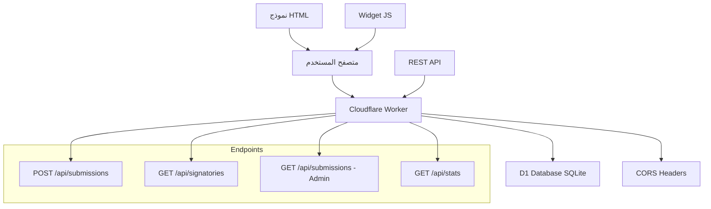

# 📝 Form CF - نظام الاستمارات البسيط والرخيص

نظام استمارات مبني على **Cloudflare Workers** و **D1 Database** لإنشاء استمارات أونلاين بسيطة وسهلة وبتكلفة منخفضة جداً.

## ✨ المميزات

- 🚀 **سريع وموثوق** - يعمل على شبكة Cloudflare العالمية
- 💰 **رخيص جداً** - تكلفة شبه مجانية مع Cloudflare Workers
- 🔧 **سهل التركيب** - إعداد في دقائق معدودة
- 🌍 **دعم العربية** - واجهة كاملة باللغة العربية
- 🔒 **حماية الخصوصية** - لا يظهر البريد الإلكتروني في القوائم العامة
- 📱 **متجاوب** - يعمل على جميع الأجهزة
- 🎨 **قابل للتخصيص** - سهل التعديل والتطوير
- 🔗 **سهل التضمين** - أضفه لأي موقع بكود بسيط

## 🏗️ البنية التقنية



## 📋 المتطلبات

- حساب [Cloudflare](https://cloudflare.com) (مجاني)
- [Node.js](https://nodejs.org) (الإصدار 18 أو أحدث)
- [Git](https://git-scm.com)

## 🚀 التركيب السريع

### 1. استنساخ المشروع

```bash
git clone https://github.com/YOUR-USERNAME/form-cf.git
cd form-cf
npm install
```

### 2. إعداد Cloudflare D1

```bash
# إنشاء قاعدة بيانات D1
npx wrangler d1 create form_db

# نسخ database_id من النتيجة وضعه في wrangler.toml
# تطبيق Migration الأولي
npx wrangler d1 migrations apply form_db

# التحقق من الجداول
npx wrangler d1 execute form_db --command="SELECT name FROM sqlite_master WHERE type='table';"
```

### 3. تحديث الإعدادات

افتح `wrangler.toml` وحدث:

```toml
# استبدل YOUR-D1-DATABASE-ID بالمعرف الصحيح
database_id = "your-actual-d1-database-id"

[vars]
# غير هذا لرمز سري قوي
ADMIN_BEARER = "your-super-secret-admin-token-here"
# أضف النطاقات المسموحة
ALLOWED_ORIGINS = "https://yoursite.com,https://anotherdomain.com"
```

### 4. النشر

```bash
# نشر على Cloudflare Workers
npm run deploy

# أو للتطوير المحلي
npm run dev
```

## 📖 طرق الاستخدام

### 1. النموذج البسيط (بدون JavaScript)

```html
<form action="https://your-worker.workers.dev/api/submissions" method="post">
    <label>الاسم: <input name="name" required></label>
    <label>المؤسسة: <input name="org"></label>
    <label>البريد: <input name="email" type="email" required></label>
    <label>تعليق: <textarea name="comment"></textarea></label>
    <label>
        <input name="consent_public" type="checkbox" value="1">
        أوافق على عرض اسمي وتعليقي علناً
    </label>
    <button type="submit">إرسال</button>
</form>
```

### 2. الويدجت المتطور (مع JavaScript)

```html
<!-- أضف هذا في HTML -->
<div id="form-widget" 
     data-formcf-url="https://your-worker.workers.dev"
     data-formcf-lang="ar"></div>

<!-- أضف السكريبت -->
<script src="https://your-domain.com/embed-code.js"></script>
```

أو استخدم الطريقة اليدوية:

```html
<div id="my-form"></div>
<script src="path/to/embed-code.js"></script>
<script>
FormCF.init('my-form', 'https://your-worker.workers.dev', {
    language: 'ar',
    theme: 'light'
});
</script>
```

### 3. عرض قائمة الموقعين

```html
<div id="signatories-list"></div>
<script>
fetch('https://your-worker.workers.dev/api/signatories')
    .then(res => res.json())
    .then(data => {
        const html = data.signatories.map(sig => `
            <div>
                <strong>${sig.name}</strong>
                ${sig.org ? ` - ${sig.org}` : ''}
                ${sig.comment ? `<p>${sig.comment}</p>` : ''}
            </div>
        `).join('');
        document.getElementById('signatories-list').innerHTML = html;
    });
</script>
```

## 🔌 واجهة برمجة التطبيقات (API)

### إرسال نموذج جديد
```http
POST /api/submissions
Content-Type: application/x-www-form-urlencoded

name=أحمد محمد&email=ahmed@example.com&org=منظمة&comment=تعليق&consent_public=1
```

**الاستجابة:**
```json
{
  "success": true,
  "id": "uuid-here",
  "message": "تم إرسال النموذج بنجاح. شكراً لك!"
}
```

### جلب قائمة الموقعين العامة
```http
GET /api/signatories
```

**الاستجابة:**
```json
{
  "success": true,
  "count": 25,
  "signatories": [
    {
      "name": "أحمد محمد",
      "org": "منظمة حقوق الإنسان", 
      "comment": "أدعم هذه المبادرة",
      "created_at": 1703097600000
    }
  ]
}
```

### جلب الإحصائيات
```http
GET /api/stats
```

**الاستجابة:**
```json
{
  "success": true,
  "total_submissions": 150,
  "public_signatures": 120
}
```

### عرض البيانات الكاملة (للمشرف)
```http
GET /api/submissions
Authorization: Bearer your-admin-token
```

## ⚙️ التخصيص والتطوير

### إضافة حقول جديدة

1. **عدّل الجدول:**
```sql
ALTER TABLE submissions ADD COLUMN phone TEXT;
ALTER TABLE submissions ADD COLUMN city TEXT;
```

2. **حدث التحقق في `worker.ts`:**
```typescript
function validateSubmission(payload: any) {
    // أضف التحقق من الحقول الجديدة
    const phone = (payload.phone || "").toString().trim();
    const city = (payload.city || "").toString().trim();
    
    // أضف لمتغير البيانات
    return { 
        ok: ..., 
        errors: ..., 
        data: { name, email, org, comment, phone, city, consent_public } 
    };
}
```

3. **حدث SQL INSERT:**
```typescript
await env.DB.prepare(
    `INSERT INTO submissions (id, created_at, name, org, email, comment, phone, city, consent_public, ip_hash, ua)
     VALUES (?, ?, ?, ?, ?, ?, ?, ?, ?, ?, ?)`
).bind(id, created_at, data.name, data.org, data.email, data.comment, data.phone, data.city, data.consent_public ? 1 : 0, ip_hash, ua).run();
```

### تخصيص التصميم

عدّل CSS في `embed-code.js` أو `worker.ts` لتغيير:
- الألوان والخطوط
- التخطيط والأحجام  
- الرسائل والنصوص
- التأثيرات والانيميشن

### إعداد حماية ضد السبام

1. **أضف Cloudflare Turnstile:**
```html
<div class="cf-turnstile" data-sitekey="your-site-key"></div>
```

2. **فعّل Rate Limiting من لوحة Cloudflare**

3. **أضف التحقق من IP:**
```typescript
// في worker.ts
const submissions_today = await env.DB.prepare(
    `SELECT COUNT(*) as count FROM submissions 
     WHERE ip_hash = ? AND created_at > ?`
).bind(ip_hash, Date.now() - 86400000).first();

if (submissions_today.count >= 5) {
    return jsonResponse(
        { success: false, error: "تم الوصول للحد الأقصى من الإرسال اليومي" }, 
        { status: 429 }
    );
}
```

## 🔒 الأمان والخصوصية

- ✅ **CORS محدود** - فقط النطاقات المسموحة
- ✅ **Rate Limiting** - حد أقصى للطلبات
- ✅ **Hash للـ IP** - لا نحفظ عناوين IP مكشوفة
- ✅ **البريد الإلكتروني مخفي** - لا يظهر في القوائم العامة
- ✅ **التحقق من البيانات** - validation كامل
- ✅ **رمز مشرف سري** - للوصول للبيانات الحساسة

## 📊 المراقبة والإحصائيات

### عرض اللوجات المباشرة
```bash
npm run tail
```

### تصدير البيانات
```bash
# تصدير كامل للبيانات
npx wrangler d1 execute form_db --command=".dump" > backup.sql

# تصدير بصيغة CSV
npx wrangler d1 execute form_db --command="SELECT name,email,org,comment,created_at FROM submissions;" --format=table
```

### إحصائيات التكلفة
مع Cloudflare Workers:
- **100,000 طلب/يوم مجاناً**
- **$0.50 لكل مليون طلب إضافي**
- **قاعدة D1 مجانية حتى 5GB**

## 🛠️ الأوامر المفيدة

```bash
# التطوير المحلي
npm run dev

# النشر للإنتاج  
npm run deploy

# مراقبة اللوجات
npm run tail

# التحقق من الكود
npm run type-check

# إنشاء قاعدة بيانات جديدة
npm run db:create

# تطبيق migrations
npm run db:migrate

# فحص البيانات
npm run db:console
```

## 🐛 حل المشاكل الشائعة

### خطأ "Database not found"
```bash
# تأكد من إنشاء قاعدة البيانات
npx wrangler d1 create form_db
# نسخ database_id لـ wrangler.toml
# تطبيق migrations
npx wrangler d1 migrations apply form_db
```

### خطأ CORS
- تأكد من إضافة نطاقك في `ALLOWED_ORIGINS`
- للتطوير المحلي أضف `http://localhost:3000`

### "Unauthorized" عند الوصول للبيانات
- تأكد من تحديث `ADMIN_BEARER` في `wrangler.toml`
- استخدم `Authorization: Bearer your-token` في الطلب

## 🤝 المساهمة

1. Fork المشروع
2. إنشاء branch جديد (`git checkout -b feature/amazing-feature`)
3. Commit التغييرات (`git commit -m 'Add amazing feature'`)
4. Push للـ branch (`git push origin feature/amazing-feature`)  
5. فتح Pull Request

## 📄 الترخيص

هذا المشروع مرخص تحت رخصة MIT - انظر ملف [LICENSE](LICENSE) للتفاصيل.

## 📞 الدعم

- 🐛 **مشاكل تقنية:** افتح [Issue جديد](https://github.com/YOUR-USERNAME/form-cf/issues)
- 💬 **أسئلة عامة:** [Discussions](https://github.com/YOUR-USERNAME/form-cf/discussions)
- 📧 **تواصل مباشر:** your-email@example.com

## 🙏 شكر وتقدير

- [Cloudflare Workers](https://workers.cloudflare.com) للبنية التحتية الرائعة
- [D1 Database](https://developers.cloudflare.com/d1/) لقاعدة البيانات السريعة
- [Wrangler](https://developers.cloudflare.com/workers/wrangler/) لأدوات التطوير

---

**صنع بـ ❤️ لجعل الاستمارات أبسط وأرخص للجميع**